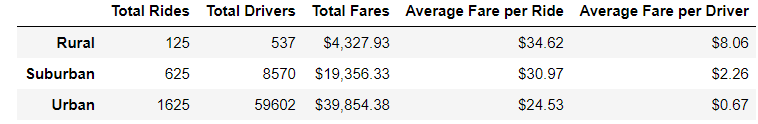
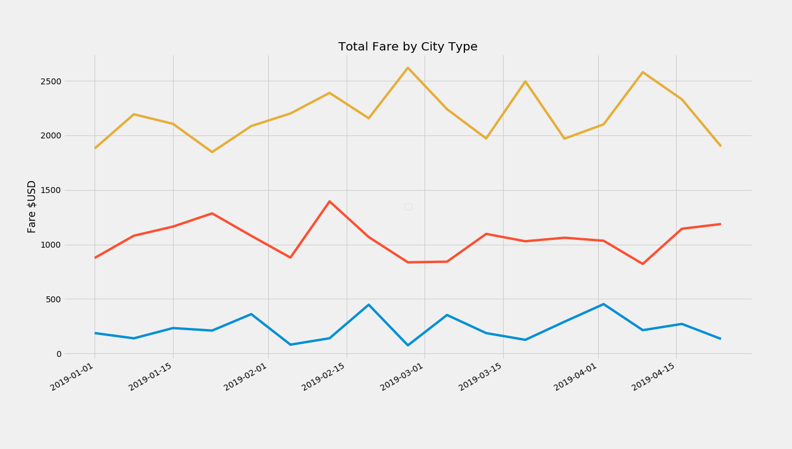

# PyBer_Challenge

## Pyber Ride Summary

The summmar shows that Urban areas have the highest amount of drivers and riders, meaning that they collect the largest amount of fares.  However, the average fare per rider is higher in the rural and suburban areas, suggesting those areas are more profitable

##Pyber Ride Trend

Once again, we see Total Fares are highest in the urban areas mostly because of the highest number of rides.  This stays consistent over Q1.

In summary, Drivers in the Rural and Suburban areas have higher profitability, but that may be due to the higher average fare amounts.  Urban areas are busier, but with shorter fares.  
